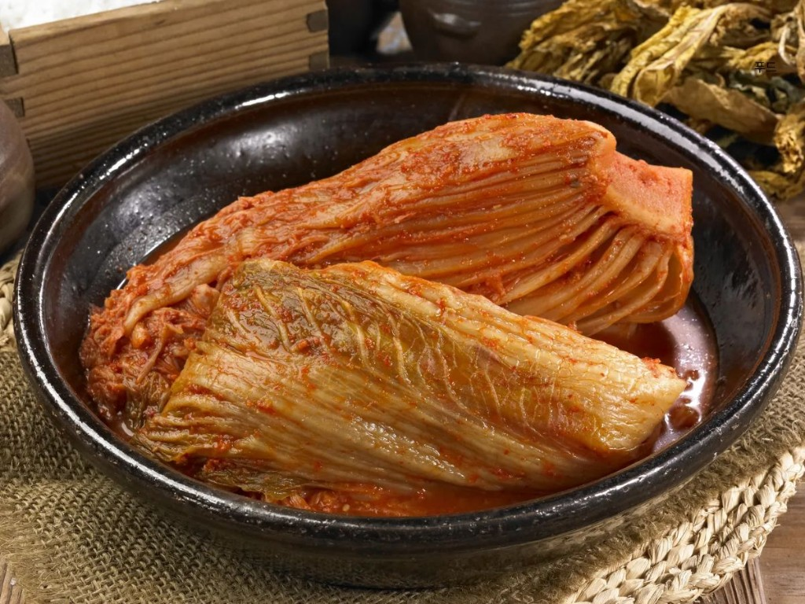

# 🖼️ 이미지 교체 가이드

현재 웹사이트는 Unsplash의 고화질 샘플 이미지를 사용하고 있습니다.
실제 사진으로 교체하려면 아래 가이드를 따라주세요.

## 📁 필요한 이미지 목록

### 1. 메인 페이지 (index.html)

#### 히어로 섹션 배경
- **파일명**: `images/kimchi-hero.jpg`
- **권장 크기**: 1920 x 1080px (Full HD)
- **내용**: 맛깔스러운 김치 또는 한국 전통 상차림
- **HTML 위치**: Line 100 (hero section의 style 속성)
- **교체 방법**:
  ```html
  <!-- 현재 -->
  style="background-image: linear-gradient(...), url('https://images.unsplash.com/...');"
  
  <!-- 교체 후 -->
  style="background-image: linear-gradient(...), url('images/kimchi-hero.jpg');"
  ```

#### 제조 시설 히어로
- **파일명**: `images/factory-hero.jpg`
- **권장 크기**: 1600 x 900px
- **내용**: 현대식 식품 제조 공장 외관 또는 내부
- **HTML 위치**: Line 270 (facility-hero img src)

#### 제조 공정 이미지 (3개)
1. **다단계 세척**: `images/process-cleaning.jpg` (800x600px)
   - Line 280 (feature-card-image 1번째)
2. **금속 검출**: `images/process-inspection.jpg` (800x600px)
   - Line 292 (feature-card-image 2번째)
3. **저온 저장**: `images/process-storage.jpg` (800x600px)
   - Line 304 (feature-card-image 3번째)

#### 제품 이미지 (6개)
1. **포기김치**: `images/kimchi-pogi.jpg` (800x600px)
   - Line 206 (product-card-image 1번째)
2. **백김치**: `images/kimchi-baek.jpg` (800x600px)
   - Line 217 (product-card-image 2번째)
3. **총각김치**: `images/kimchi-chonggak.jpg` (800x600px)
   - Line 227 (product-card-image 3번째)
4. **열무김치**: `images/kimchi-yeolmu.jpg` (800x600px)
   - Line 237 (product-card-image 4번째)
5. **갓김치**: `images/kimchi-gat.jpg` (800x600px)
   - Line 247 (product-card-image 5번째)
6. **깍두기**: `images/kimchi-kkakdugi.jpg` (800x600px)
   - Line 257 (product-card-image 6번째)

### 2. 회사 소개 (about.html)

#### CEO 프로필 사진
- **파일명**: `images/ceo-photo.jpg`
- **권장 크기**: 800 x 800px (정사각형)
- **내용**: 대표이사 김기범 님의 공식 프로필 사진
- **HTML 위치**: Line 108 (CEO section)
- **교체 방법**:
  ```html
  
  ```

### 3. 제품 소개 (products.html)

제품 이미지는 index.html과 동일한 파일을 사용합니다.
- Line 136-220에 걸쳐 6개 제품 이미지가 사용됩니다.

### 4. 위생·인증 (quality.html)

#### 인증서 이미지 (3개)
1. **HACCP 인증서**: `images/cert-haccp.jpg`
   - 권장 크기: 1200 x 1600px (A4 비율)
   - 내용: 식품안전관리인증기준(HACCP) 인증서 스캔본
   
2. **공장등록증**: `images/cert-factory.jpg`
   - 권장 크기: 1200 x 1600px
   - 내용: 공장등록증명서 스캔본
   
3. **사업자등록증**: `images/cert-business.jpg`
   - 권장 크기: 1200 x 1600px
   - 내용: 사업자등록증 스캔본

**참고**: 인증서 이미지는 modal popup에서 확대되므로 고해상도가 필요합니다.

## 🔄 이미지 교체 단계

### 방법 1: HTML 파일에서 직접 교체

1. 각 HTML 파일을 텍스트 에디터로 엽니다
2. `<!-- 이미지 교체: ... -->` 주석을 찾습니다
3. 주석 바로 아래 `


<!-- 변경 후 -->

```

### 방법 2: Find & Replace 사용

VS Code 또는 텍스트 에디터에서:
1. `Ctrl + H` (Find & Replace)
2. **Find**: `https://images.unsplash.com/photo-1588515724527-074a7a56616c?q=80&w=800&auto=format&fit=crop`
3. **Replace**: `images/kimchi-pogi.jpg`
4. Replace All

## 📏 이미지 최적화 가이드

### 권장 사양
- **포맷**: JPEG (사진), PNG (로고/인증서)
- **압축**: 품질 85% (JPG)
- **용량**: 500KB 이하 권장
- **해상도**: 
  - 히어로 배경: 1920 x 1080px
  - 제품 이미지: 800 x 600px
  - 인증서: 1200 x 1600px
  - CEO 프로필: 800 x 800px

### 온라인 압축 도구
- [TinyPNG](https://tinypng.com/) - PNG/JPG 압축
- [Squoosh](https://squoosh.app/) - Google의 이미지 압축
- [Compressor.io](https://compressor.io/) - 무손실 압축

### Photoshop 사용 시
1. File → Export → Save for Web (Legacy)
2. Format: JPEG
3. Quality: 80-85
4. Progressive: ✓
5. Convert to sRGB: ✓

## 🎨 이미지 촬영 팁

### 제품 사진 (김치)
- ✅ 자연광 또는 스튜디오 조명 사용
- ✅ 흰색 배경 또는 원목 테이블
- ✅ 다양한 앵글 촬영 (위에서, 옆에서)
- ✅ 색감이 선명하게 나오도록
- ❌ 과한 필터 사용 금지

### 공장 시설
- ✅ 청결한 모습 강조
- ✅ 넓은 공간감 표현
- ✅ 밝은 조명
- ✅ 작업자 복장 단정하게
- ❌ 어둡거나 지저분한 모습

### CEO 프로필
- ✅ 정장 착용
- ✅ 밝은 표정
- ✅ 배경은 단색 또는 사무실
- ✅ 고해상도 (최소 2000x2000px)

## 📝 이미지 교체 체크리스트

### index.html
- [ ] 히어로 배경 이미지
- [ ] 공장 시설 히어로
- [ ] 다단계 세척 이미지
- [ ] 금속 검출 이미지
- [ ] 저온 저장 이미지
- [ ] 포기김치
- [ ] 백김치
- [ ] 총각김치
- [ ] 열무김치
- [ ] 갓김치
- [ ] 깍두기

### about.html
- [ ] CEO 프로필 사진

### quality.html
- [ ] HACCP 인증서
- [ ] 공장등록증
- [ ] 사업자등록증

### products.html
- [ ] 제품 이미지 6종 (index.html과 동일)

## 🔍 문제 해결

### 이미지가 표시되지 않아요
1. 파일명 확인 (대소문자 구분)
2. 파일 경로 확인 (`images/` 폴더 안에 있는지)
3. 파일 확장자 확인 (.jpg, .jpeg, .png)
4. 브라우저 캐시 삭제 (Ctrl + F5)

### 이미지가 깨져 보여요
1. 이미지 용량 확인 (너무 크지 않은지)
2. 이미지 포맷 확인 (JPEG, PNG만 사용)
3. 이미지 압축 (TinyPNG 사용)

### 모바일에서 느려요
1. 이미지 용량 줄이기 (500KB 이하)
2. WebP 포맷 사용 고려
3. Lazy Loading 활성화

## 💡 추가 팁

### WebP 포맷 사용
더 나은 압축률을 원한다면 WebP 포맷을 사용하세요:

```html
<picture>
  <source srcset="images/kimchi-pogi.webp" type="image/webp">
  
</picture>
```

### Lazy Loading
이미지 로딩 성능 개선:

```html

```

### Retina 디스플레이 대응
고해상도 화면을 위한 2배 크기 이미지:

```html

```

## 📞 지원

이미지 교체 관련 문의사항이 있으시면:
- 프로젝트 README.md 참고
- HTML 주석 확인
- 브라우저 개발자 도구(F12) 콘솔 확인

---

**참고**: 현재 사용 중인 Unsplash 이미지는 샘플용이므로 실제 서비스에서는 반드시 자체 이미지로 교체해야 합니다.
